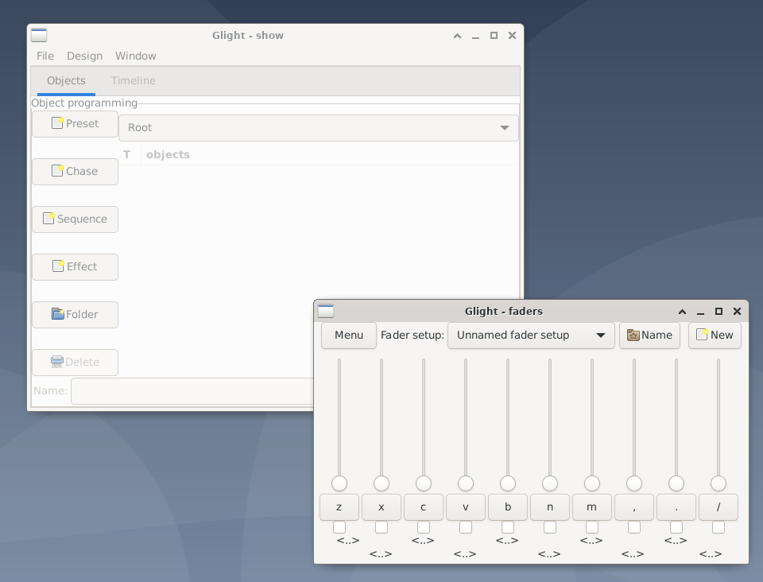
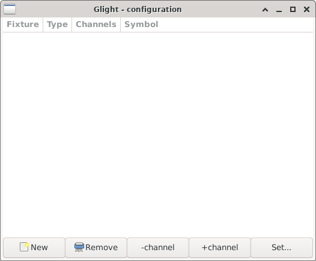
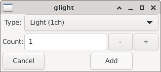
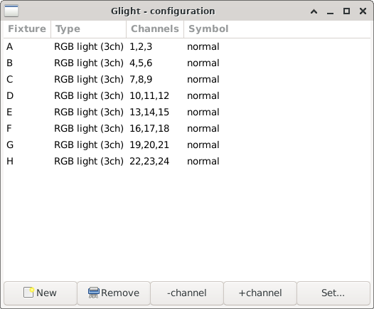
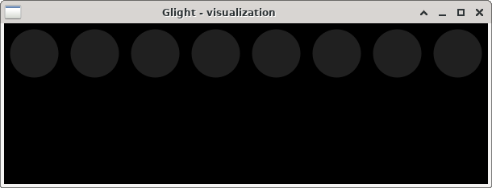
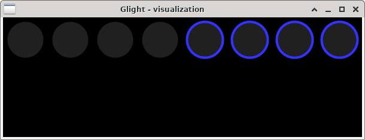
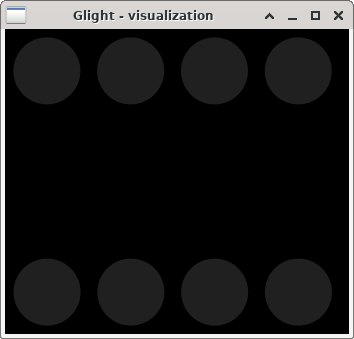
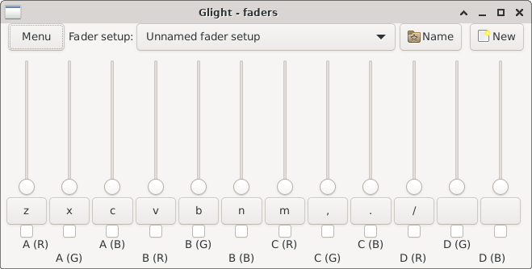
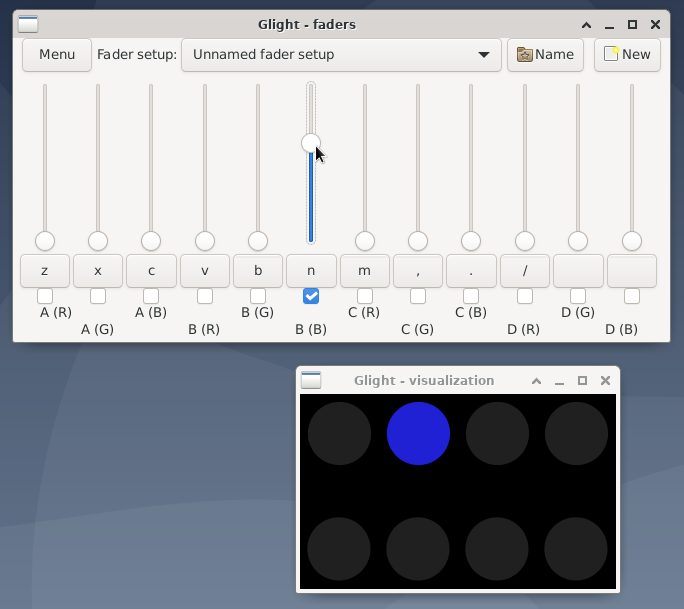

Tutorial
========

This tutorial will demonstrate how to make a simple show. It is assumed
that we have 8 simple RGB spots, of which 4 are located on each side
of a room / dance floor / theatre / ...

It is not necessary to have these exact same (number of) lights to follow
the tutorial. 

Connection to DMX interface
---------------------------

Upon start, Glight will connect to OLA, a daemon that controls the DMX
devices. Therefore, before starting Glight, make sure that OLA is
running and correctly configured. See the OLA documentation for more info
on how to do this.

Starting Glight
---------------

When glight is started, two windows will show:

1. The *show* window (left on image). This window contains the main menu bar, a list of
   all objects in your show and some buttons to create things.

2. A default fader window. This window holds 10 faders. These are not yet
   connected to anything, and will therefore not do anything.
   
Adding fixtures
---------------

The first step in order to control lights, is to add these lights to Glight and
configure these. All controllable devices, such as lights, are called *fixtures*
in Glight. From the show window, open the *Window* menu and select *Fixture list*.

.. note:: Fixtures can also be added from the visualization window, discussed later.

A new window appears:

Press the *New* button to open another window:

In the drop down menu, select the appropriate light. Many lights have different DMX
modes, so some light types are shown multiple times but with different number of
channels. To make controlling the colours with Glight easy, it is recommended that
a DMX mode is used that has one channel per colour (RGB) and no master channel.

.. note:: Unlike most other DMX software, Glight does not try to list all possible brands
and types, but makes you select one of the a functional categories of the light,
such as *RGB*, *RGBA*, *RGBW*, *RGBAW+UV* etc. If you cannot find an appropriate
description for your fixtures, please let me know.
    
Select a basic *RGB light (3ch)* light, change *Count* to 8 and press *Add*. 

As shown, Glight has added 8 RGB lights with names A, B, ..., H and 
with consecutive DMX channels. If this is
not correct, the DMX channels can be changed by selecting a RGB light and by:

- pressing the + or - buttons to increase or decrease by one channel at a time;
- or by pressing the *Set...* button to type in the start DMX channel of the fixture.

When done,
close the fixture list window.

Be aware that the order of the fixtures is important when creating chases. It is
easiest when fixtures are ordered such that the ordering has a physical meaning 
as well, e.g. the first fixtures is the left-most fixture, the next fixture is
the one next to it, etc.

Setting fixture positions
-------------------------

Glight uses a simple visualization screen to display the state of the show.
On the main window, open the *Windows* menu and select *Visualization*.
A mostly black window appears with 8 circles as symbols the lights:

The lights in this window should reflect their position in real life. In our
case, we are dealing with 4 lights on both sides of a dance floor. Therefore,
we will move the right-most 4 lights to the bottom. This is done by
first drawing a rectangle around the circles to fully enclose them. This
selects these four lights, which is shown by a blue band around the lights:

Now, click and hold the mouse on one of the selected lights and drag
around to move all four selected lights. By dragging them towards the bottom
of the screen, the visualization *zooms out*, making room at the bottom.
If the lights become too small or if there's too much space on the
right, the visualization window can be resized to a more suitable size, for
example like this:

Assigning faders
----------------

Now that the lights are configured, let's start with the most basic controlling
of the lights: setting their individual colours. For this, the fader window
is used. By default, the fader window has 10 faders. However, with 8 RGB
channels, we have 24 colours to control. 24 faders are quite a lot to show
at once, so I will show how to create 2 fader frames each with 12 faders.

First we need to add 2 faders to this frame.
Press the *Menu* button on the top-left of the fader window, and select
*Add fader*. Repeat this once more to end up with 12 faders.

Faders can be assigned in several ways. The simplest way to assign a fader is
by pressing <..> below the fader. This opens an object list showing your
lights A..H. Select one, then select which *Input* to assign the 
fader to (R, G or B), and press *Select* to assign the individual fader.

This would be rather repetitive to repeat 24 times. From the fader menu,
it is also possible to select the option *Assign*, which assigns
all the faders within this frame one by one to all (unassigned) inputs.
After this, the fader window looks like this:

Note the text under the faders, saying (for example) "*A (R)*". This refers
to fixture A, channel R.

Controlling lights
------------------
  
We are now ready to control lights! Drag one of the faders up, and the
corresponding light will turn on with that particular colour. If it does not turn
on, check your OLA settings, DMX channel settings and connections.

The change is visible in the visualization window:

Using faders is an important aspect of controlling the lights in a live show,
and there are several ways to control the faders by either mouse or keyboard:

- Fine control with the mouse is possible by dragging the fader up and down.
  This can be clumsy during a show, so is generally not advisable for fading.
  Smooth fading can be achieved in other ways.
- Clicking the check-box will turn the channel completely on or off at once.
- The button between the check-box and fader (with a single letter in it) can
  be used to flash / briefly turn a fader on. The fader will be on only on as long
  as the mouse button is hold down.
- The letters on the flash button of each fader specifies a key that can be
  pressed to switch the fader on or off. For the image, for example, pressing
  the 'n' key would switch the fader off again. By default, each fader window
  is assigned to a row of key on a standard US keyboard.
- Finally, by holding shift while pressing a key will flash that channel as
  long as the key is hold.

Fader setups
------------

