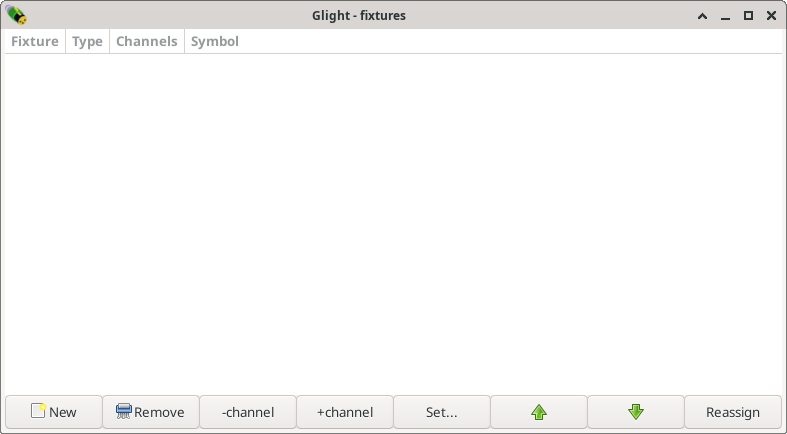
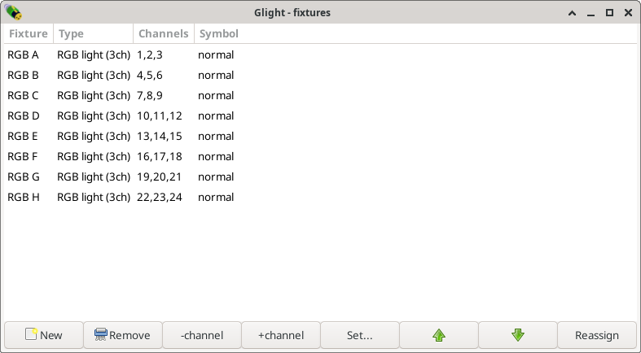

Add fixtures
------------

The first step in order to control lights, is to add these lights to Glight and
configure these. All controllable devices, such as lights, are called *fixtures*
in Glight. From the show window, open the *Window* menu and select *Fixture list*.

.. note:: Fixtures can also be added from the visualization window, discussed later.

A new window appears:

Press the *New* button to open another window:

In the drop down menu, select the appropriate light. Many lights have different DMX
modes, so some light types are shown multiple times but with different number of
channels. To make controlling the colours with Glight easy, it is recommended that
a DMX mode is used that has one channel per colour (RGB) and no master channel.

.. note:: Unlike most other DMX software, Glight does not try to list all possible brands
   and types, but makes you select one of the functional categories of the light,
   such as *RGB*, *RGBA*, *RGBW*, *RGBAW+UV* etc. If you cannot find an appropriate
   description for your fixtures, you may define a new *fixture type*.
    
Select a basic *RGB light (3ch)* light, change *Count* to 8 and press *Add*. 

As shown, Glight has added 8 RGB lights with names A, B, ..., H and 
with consecutive DMX channels. If the channels are
not correct, the DMX channels can be changed by selecting a RGB light and by:

- pressing the + or - buttons to increase or decrease the DMX channel by one channel at a time;
- or by pressing the *Set...* button to type in the start DMX channel of the fixture.

When done, close the fixture list window.

Be aware that the order of the fixtures is relevant when creating chases. It is
easiest when fixtures are ordered such that the ordering has a physical meaning 
as well, e.g. the first fixtures is the left-most fixture, the next fixture is
the one next to it, etc.

Next chapter: :doc:`position-fixtures`
