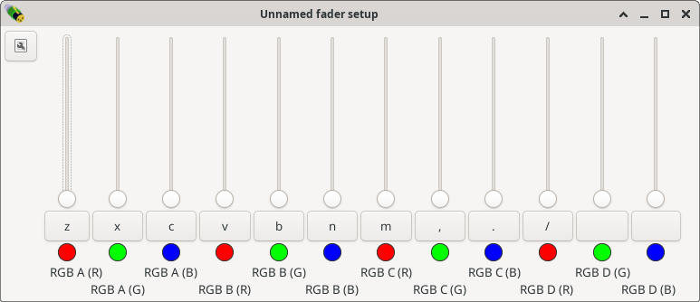

Assigning faders
----------------

Now that the lights are configured, let's start with the most basic controlling
of the lights: setting their individual colours. For this, the fader window
is used. By default, the fader window has 10 faders. However, with 8 RGB
channels, we have 24 colours to control. 24 faders are quite a lot to show
at once, so I will show how to create 2 fader frames each with 12 faders.

First we need to add 2 faders to this frame.
Press the *Menu* button on the top-left of the fader window, and select
*Add fader*. Repeat this once more to end up with 12 faders.

Faders can be assigned in several ways. The simplest way to assign a fader is
by pressing <..> below the fader. This opens an object list showing your
lights A..H. Select one, then select which *Input* to assign the 
fader to (R, G or B), and press *Select* to assign the individual fader.

This would be rather repetitive to repeat 24 times. From the fader menu,
it is also possible to select the option *Assign*, which assigns
all the faders within this frame one by one to all (unassigned) inputs.
After this, the fader window looks like this:

Note the text under the faders, saying (for example) "*A (R)*". This refers
to fixture A, channel R.

Next chapter: :doc:`controlling-lights`
