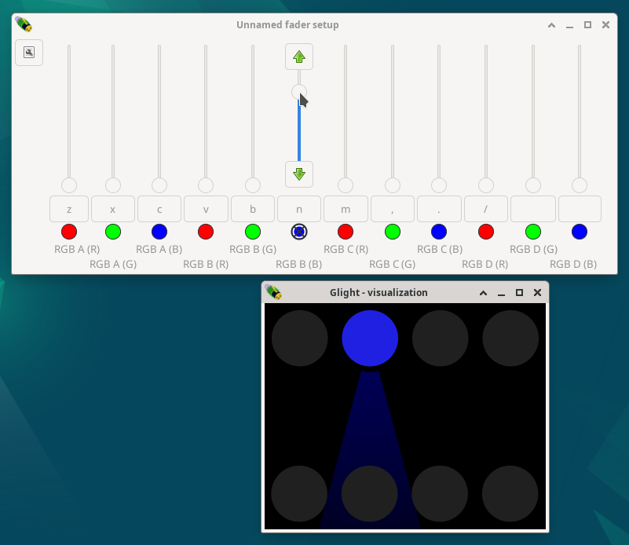

Controlling lights
------------------
  
We are now ready to control lights! Drag one of the faders up, and the
corresponding light will turn on with that particular colour. If it does not turn
on, check your OLA settings, DMX channel settings and connections.

The change is also visible in the visualization window:

.. Hint:: The direction of the beam can be redirected by selecting the
  relevant fixtures in the visualization window, clicking with the right
  mouse button on one of them and selecting "*Properties*".
    
Using faders is an important aspect of controlling the lights in a live show,
and there are several ways to control the faders by either mouse or keyboard:

- Fine control with the mouse is possible by dragging the fader up and down.
  This can be clumsy during a show, so is generally not advisable for fading.
  Smooth fading can be achieved in other ways.
- Clicking the check-box will turn the channel completely on or off at once.
- The button between the check-box and fader (with a single letter in it) can
  be used to flash / briefly turn a fader on. The fader will be on only on as long
  as the mouse button is hold down.
- When hovering with the mouse over a fader, a up and/or down arrow button
  appears. Pressing these will fade in or out the light, correspondingly.
- The letters on the flash button of each fader specifies a key that can be
  pressed to switch the fader on or off. For the image, for example, pressing
  the 'n' key would switch the fader off again. By default, each fader window
  is assigned to a row of key on a standard US keyboard.
- Finally, by holding shift while pressing a key will flash that channel as
  long as the key is hold.

Fader groups
------------

The previously created fader group controls the upper row of lights. A second frame
is required to control the lower row of lights. Before we do this, we will
give our first fader group a name to be able to distinguish it. Press the
top left button on the fader window to make a menu apear. Select the
*Name* button and name the fader window appropriately, for example "*Upper lights*".

Make a new fader frame by, from the main window, open the *Window* menu, then
the *Fader windows* submenu and select *New*. In this new window, add again
two faders and select the *assign* option to assign the faders to the remaining
inputs, and name the group *Lower lights*. 

Each group may be assigned distinct settings, such as fading speed and solo
mode. These are saved per frame, even if the frame is hidden. The size of
the frame will also be restored when the frame is hidden and reshown. 

Next chapter: :doc:`designing-chases`
