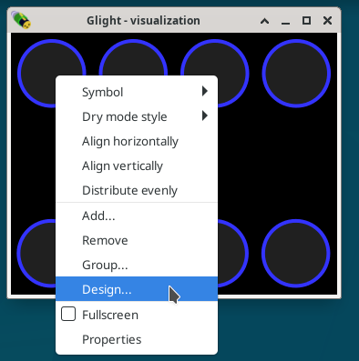
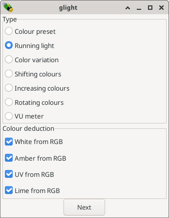
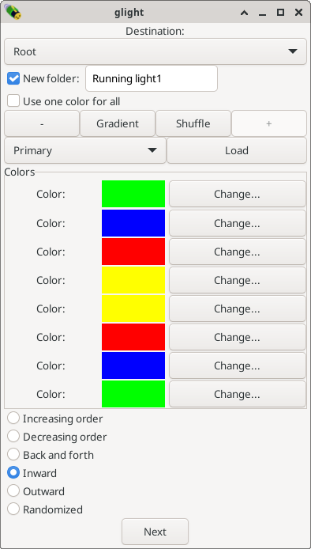
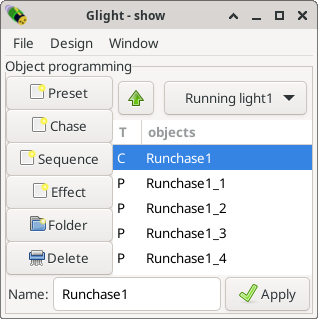

Designing chases
----------------

Controlling each channel individually is fun, but tedious. A particular setting
of the lights can be stored as a *preset*, and presets can be sequenced to
create a *chase*. Creating a chase like this is very flexible, but still very
low level and a bit of work. A quicker way of creating simple chases is by
using the *design wizard* of Glight. Let's do this...

In the visualization window, select all the lights and right click on one
of the lights. From the pop-up menu, select the *Design...* option.

The design window appears, showing all of the lights already selected. 
Since we want to create a chase involving all the lights, this is
what we want. If we were creating a chase with only the 4 upper row lights,
we could have selected those 4 in the visualization window, or we
could change the selection at this point in the design window.

Press the *next* button to continue the design process. The next step
is to select what type of chase (or effect) we want to create. Select
*Running light*: this is a simple chase that switches one light on
at a time and moves it from one to another light. Note also the options
in the bottom half of the screen, which affect how amber, white or
UV channels are going to be interpreted, if present.

Press next to go to the colour selection step. Here we can assign a
colour to each light. Another choice to make is the kind of movement
that should be made. *Increasing order*, *decreasing order*, *back
and forth* and *random* will switch one light on at a time. With
two rows of lights, that is not what we want.

.. note:: By default, every light is assigned to a step in the
   chase. The + and - buttons on the top of the window can be used to
   increase/decrease the number of steps. When there are fewer steps
   than lights, the sequency is copied untill all lights are
   involved. For example, by using only
   two steps, four lights will be on at the same time.

Select *inward* and some nice colours and press next to create the chase.
The main window will now show several *Runchase* objects:

It shows one chase ('C') object and four presets ('P'). Each preset
is one of the steps of the chase. The chase and presets
can be manipulated individually by double clicking on them. 

Before doing so, it is useful to turn on the chase, as follows:

* Open a new fader group frame, and assign the first fader to
  *Runchase1*.
* Optionally, rename the fader group to "*Chases*" and close the
  other fader frames.
* Switch the *Runchase1* fader on.

You should now see your lights animate!

Next chapter: :doc:`modifying-chases`

