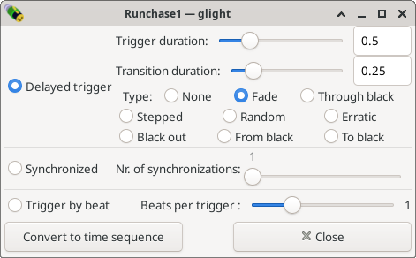

Modifying a chase
-----------------

On the main window, double click *Runchase1* to open the chase editor.

Here you can set the speed of the chase and optionally a transition effect.
Discover the settings by selecting the different options one by one.
To use the automatic beat finder, select "*Trigger by beat*" (with one
beat per trigger). If your microphone works and music is being played,
the chase will move on the beat of the music!

Next chapter: :doc:`theres-more`
