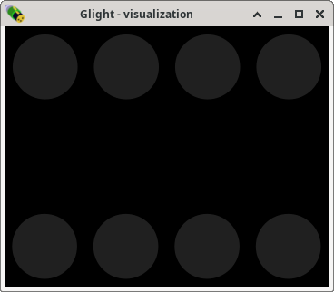

Setting fixture positions
-------------------------

Glight uses a simple visualization screen to display the state of the show.
On the main window, open the *Windows* menu and select *Visualization*.
A mostly black window appears with 8 circles as symbols the lights:

The lights in this window should reflect their position in real life. In our
case, we are dealing with 4 lights on both sides of a dance floor. Therefore,
we will move the right-most 4 lights to the bottom. This is done by
first drawing a rectangle around the circles to fully enclose them. This
selects these four lights, which is shown by a blue band around the lights:

.. image:: images/visualization-window-4-lights-selected.png
    :alt: Visualization window with 8 RGB lights of which 4 are selected.

Now, click and hold the mouse on one of the selected lights and drag
around to move all four selected lights. By dragging them towards the bottom
of the screen, the visualization *zooms out*, making room at the bottom.
If the lights become too small or if there's too much space on the
right, the visualization window can be resized to a more suitable size, for
example like this:

Next chapter: :doc:`assign-faders`
