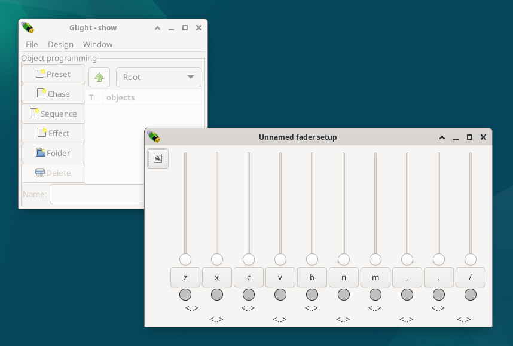

Connection to DMX interface
---------------------------

Upon start, Glight will connect to the
`Open Lighting Architecture <https://www.openlighting.org/ola/>`_ (OLA),
a daemon that controls the DMX
devices. Therefore, before starting Glight, make sure that OLA is
running and correctly configured. See the OLA documentation for more info
on how to do this.

If OLA is not working, Glight will use a dummy output.

Starting Glight
---------------

When glight is started, two windows will show:

1. The *show* window (left on image). This window contains the main menu bar, a list of
   all objects in your show and some buttons to create things.

2. A default fader window. This window holds 10 faders. These are not yet
   connected to anything, and will therefore not do anything.
   
Next chapter: :doc:`add-fixtures`
